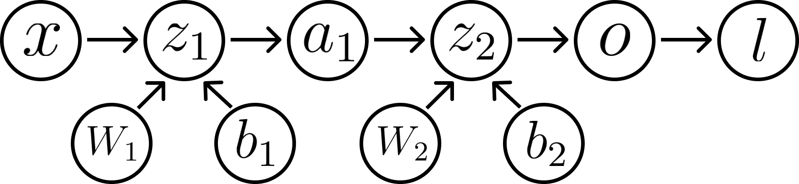

Title: Backpropagation from First Principles
Time: 11/20/2023
Tags: machine-learning, gradients
Publish: True

Calculating symbolic expressions for gradients of common loss functions and architectures in deep learning by hand can often be confusing and error-prone, especially when first learning the subject. 

The purpose of this blog post is to discuss this material with a particular focus on the following questions - 

* How do we define gradients of arbitrary differentiable real-valued functions?
* Why is it okay to "flatten" the input when computing the gradient of a function with respect to a matrix?
* How does the Chain Rule apply to the computation of gradients? 
* How do we propagate gradients back through linear layers and other mappings from matrices to vectors?

Enjoy.

## The Gradient of a Real-Valued Function of a Matrix

A typical treatment of multivariable calculus defines the gradient of a map $f:\mathbb{R}^n \to \mathbb{R}$ at a point $a$ as the vector of partial derivatives of $f$ at $a$:

$$
\nabla f(a) 
= 
\begin{pmatrix}
\frac{\partial f}{\partial x_1} (a) \\
\vdots \\
\frac{\partial f}{\partial x_n} (a) \\
\end{pmatrix}.
$$

The gradient is useful because it gives the direction of steepest increase for a local, linear approximation to $f$. 

How do we define the gradient of $f$ if its input is a $m \times n$ matrix $A$? Our intuition might be to think of the matrix $A$ as a long vector; compute the partial derivatives of $f$ with respect to each entry in $A$, and organize the partial derivatives into a matrix of the same shape.

This intuition is correct, but let's see how we can prove this formally. We'll start by discussing how gradients are defined in arbitrary inner product spaces. 

### Gradients in general

Suppose that $f$ is a mapping from an inner product space $V$ to $\mathbb{R}$. We'll denote the inner product on $V$ by $\langle \cdot, \cdot {\rangle}_V$. Recall that the derivative of $f$ at a point $v$ (if it exists) is a linear map from $V$ to $\mathbb{R}$, which we'll denote by $D f(v)$, which gives the best linear approximation to the change in $f$ near $v$:

$$f(v + h) - f(v) = D f(v) h + o(h)$$

as $h \to 0$. 

The derivative approximates the change to $f$ as we move away from $v$ in some direction $h$. 
How can we use this information to identify the direction $h$ in which $f$ increases *the fastest*? 
That is, for which $h$ is $D f(v) h$ as large as possible? 

To do this, we'll need to relate $D f (v)$ to the inner product $\langle \cdot, \cdot {\rangle}_V$. 
The Riesz Representation Theorem provides this connection. 
It implies that there exists a vector $g \in V$ for which 
$$
\begin{equation}
D f (v) h = \langle h, g {\rangle}_V
\label{ipgrad}
\end{equation}
$$
for all $h$.
This means that we can find the directional derivative of $f$ in the direction of $h$ by just taking an inner product with $g$, and we can now focus on finding an $h$ which maximizes $\langle h, g {\rangle}_V$.

How do we choose $h$ to make $\langle h, g {\rangle}_V$ as large as possible? Recall the Cauchy-Schwarz inequality, which gives an upper bound on the inner product between two vectors:
$$ |\langle h, g {\rangle}_V| \leq ||h||_V\ \cdot ||g||_V $$
and says that the inner product is maximized when the vectors point in the same direction. 
In other words, the direction $h$ which increases $f$ the fastest is a (positive) scalar multiple of $g$.
Indeed, $g$ is the gradient of $f$ at $v$, and equation (\ref{ipgrad}) is how we define the gradient for real-valued functions on arbitrary inner product spaces.

### Gradients of matrix functions

Let's now return to the case of a real-valued function $f$ of a matrix $X$. Suppose that $f$ is a real-valued function on the vector space of $m \times n$ matrices, $\text{Mat}(m, n)$. 
The standard inner product on this vector space is given by 
$$
\langle A, B {\rangle}_M := \text{Tr}(AB^T)
$$
for $A, B \in \text{Mat}(m, n)$. 
By our discussion above, the gradient of $f$ at $X$ is the matrix $\nabla f (X)$ which satisfies the identity (\ref{ipgrad}) for all matrices $h$:
$$
D f (X) h = \langle h, \nabla f (X) {\rangle}_M.
$$ 

Let's show that $\nabla f (X)$ is the matrix of partial derivatives of $f$ with respect to each entry in $X$. 

Formally, we can consider the flattening map $\Phi:\text{Mat}(m, n) \to \mathbb{R}^{mn}$, which flattens an $m \times n$ matrix into a vector in row-major order. The map $\Phi$ is called an *isometry*, because it preserves inner products:

$$
\langle A, B {\rangle}_M = \text{Tr}(AB^T) = \Phi(A)^T \Phi(B) = \langle \Phi(A), \Phi(B) \rangle.
$$

This says that the inner product of two matrices $A$ and $B$ in $\text{Mat}(m, n)$ is equal to the dot product of the flattened matrices $\Phi(A)$ and $\Phi(B)$. This is easy to see once you realize that $AB^T$ is just the sum of the products of the corresponding entries of $A$ and $B$. 

Let's denote by $\tilde f$ the composition $f \circ \Phi^{-1}$, which we can think of as the "flattened version" of $f$, which takes a vector in $\mathbb{R}^{mn}$, un-flattens it into a matrix, and applies $f$. 

We want to show that the following statement is true:
$$
\begin{equation}
\nabla f(X) = \Phi^{-1}(\nabla \tilde f (x)).
\label{flattening-identity}
\end{equation}
$$
This statement says that to find the gradient of $f$ at some matrix $X$, we can first flatten $X$ (to $x$), then calculate the gradient of the "flattened version" $\tilde f$ at $x$, and then reshape the result back into a matrix.

We'll start with the derivative of $\tilde f$. 
By the Chain Rule, we have that
$$
\begin{align}
\nonumber
D \tilde f (x) &= D f \circ \Phi^{-1} (x) \\
\nonumber
&= Df(\Phi^{-1}(x)) \circ D \Phi^{-1} (x) \\
\nonumber
&= Df(\Phi^{-1}(x)) \circ \Phi^{-1}
\end{align}
$$
where the Chain Rule was used to go from the first line to the second, and the third line follows from linearity of $\Phi^{-1}$.

By definition of the gradient, $\nabla \tilde f(x)$ satisfies the identity
$$
D \tilde f(x) = \langle h, \nabla \tilde f(x) \rangle 
$$
for all vectors $h$. We will use this identity to relate the gradient of $\tilde f$ and the gradient of $f$:
$$
\begin{align}
\nonumber
D \tilde f(x)h &= D f (\Phi^{-1}(x)) \circ \Phi^{-1} h &&\ \text{by what we showed above} \\
\nonumber
&= D f (X) \circ \Phi^{-1} h \\
\nonumber
&= D f (X) \Phi^{-1}(h) \\ 
\nonumber
&= \langle \Phi^{-1}(h), \nabla f(X) {\rangle}_M &&\ \text{by definition of the gradient} \\ 
\nonumber
&= \langle h, \Phi(\nabla f(X)) \rangle &&\ \text{since $\Phi$ is an isometry}. \\ 
\end{align}
$$
In summary, we've shown that 
$$
D \tilde f(x)h = \langle h, \Phi(\nabla f(X)) \rangle
$$
for all vectors $h$, which means that $\Phi(\nabla f(X))$ must equal the gradient $\nabla \tilde f(x)$ since the gradient is unique. Note that to prove this, we only needed that $\Phi$ is linear and an isometry, and indeed this result holds for all such functions. 

Applying $\Phi^{-1}$ to both sides gives us the identity (\ref{flattening-identity}) we were after:
$$
\nabla f(X) = \Phi^{-1}(\nabla \tilde f (x))
$$

This flattening procedure is fairly self-evident, and the amount of insight gained from a proof is questionable, but at least now we can proceed with the confidence that our procedure is mathematically sound. 

## The Gradient of a Composition Composes in Reverse

The Chain Rule says that the derivative of a composition is the composition of the derivatives:
$$D f \circ g (x) = Df(g(x)) \circ Dg(x)$$
but what about the *gradient* of a composition?

Suppose that $g:\mathbb{R}^n \to \mathbb{R}^m$ and $f:\mathbb{R}^m \to \mathbb{R}$. In this case, we know that the gradient is the transpose of the Jacobian matrix, and so
$$
\begin{align}
\nonumber
\nabla f \circ g (x) &= J_{f \circ g}(x)^{T} \\ 
\nonumber
&= (J_{f}(g(x)) \cdot J_{g}(x))^T \\
\nonumber
&= J_{g}(x)^T \cdot J_{f}(g(x))^T \\
\nonumber
&= J_{g}(x)^T \cdot \nabla f(g(x)).
\end{align}
$$

The gradient of a composition is the product of the (transposed) Jacobians in *reverse* order, hence the mnemonic: *the gradient of a composition composes in reverse*.

In the next section, we'll see how the two ideas above help us compute gradients of linear layers, which are ubiquitious in deep learning. 

## The Linear Layer

A linear layer takes a $d$-dimensional input and applies the transformation $x \mapsto Wx + b$, where $W \in \text{Mat}(h, d)$ are the weights and $b \in \mathbb{R}^h$ is the bias.
If we view its output as a function of the parameter $W$, then the output is a vector-valued function of a matrix, which we'll denote by $f:\text{Mat}(h, d) \to \mathbb{R}^h$. 

How do we compute the derivative of $f$? Recall that the derivative of $f$ is the best linear approximation to the difference $f(W + H) - f(W)$. Since
$$
f(W + H) - f(W) = (W + H)x - Wx = Hx
$$
which is linear in $H$, the derivative is just the map $H \mapsto Hx$. 

This is a symbolic expression for the derivative, but to explicitly calculate the partial derivatives of the loss with respect to the entries in $W$, we'll have to calculate the Jacobian matrix of $f$. We will first flatten $W$ (identifying $\text{Mat}(h, d)$ with $\mathbb{R}^{hd}$), calculate the Jacobian of $f \circ \Phi^{-1}:\mathbb{R}^{hd} \to \mathbb{R^h}$, use the Jacobian to calculate the gradient of the loss with respect to (the flattened) $W$, and then reshape the gradient back into a matrix.

Let's make this concrete with an example. Suppose that $W = \begin{pmatrix} a & b \\ c & d \\ \end{pmatrix} \in \text{Mat}(2, 2)$ and $x = \begin{pmatrix} x_1 \\ x_2 \\ \end{pmatrix} \in \mathbb{R}^2$.

As discussed above, the flattening map $\Phi$ identifies $\text{Mat}(2, 2)$ with $\mathbb{R}^4$, and we can consider the "flattened version" of the linear layer $(W \mapsto Wx) \circ \Phi^{-1} : \mathbb{R}^4 \to \mathbb{R}^2$, given by
$$
\begin{pmatrix}
a \\ 
b \\ 
c \\ 
d \\
\end{pmatrix} 
\mapsto 
\begin{pmatrix} a & b \\ c & d \\ \end{pmatrix} 
\begin{pmatrix} x_1 \\ x_2 \\ \end{pmatrix}
= 
\begin{pmatrix} a x_1 + b x_2 \\ c x_1 + d x_2 \\ \end{pmatrix}.
$$

The bias term is omitted for simplicity and because it doesn't contribute to the gradient with respect to $W$ anyway.

This is a map whose Jacobian matrix we know how to calculate: if we organize the partial derivatives into a $2 \times 4$ matrix, we get the following Jacobian matrix:

$$
J_{\tilde f}(w) = 
\begin{pmatrix}
 x_1 & x_2 &   0 & 0   \\
 0   & 0   & x_1 & x_2 \\
\end{pmatrix}
$$

where $w = \Phi(W)$ is just the flattened $W$. 

Now, suppose that the gradient of the loss with respect to the output of the linear layer (which we'll call $z$) is $\frac{\partial l}{\partial z}$. In our example, this gradient is a vector in $\mathbb{R}^2$ (or a vector in $\mathbb{R}^h$, more generally.) 
We first calculate the gradient of the loss with respect to $w$.
Since the gradient of a composition composes in reverse, this becomes
$$
J_{\tilde f}(w)^T \cdot \frac{\partial l}{\partial z} 
= 
\begin{pmatrix}
x_1 & 0   \\
x_2 & 0   \\
0   & x_1 \\ 
0   & x_2 \\
\end{pmatrix}
\begin{pmatrix}
\partial l / \partial z_1 \\ 
\partial l / \partial z_2 \\
\end{pmatrix}
= 
\begin{pmatrix}
x_1 \frac{\partial l}{\partial z_1} \\ 
x_2 \frac{\partial l}{\partial z_1} \\ 
x_1 \frac{\partial l}{\partial z_2} \\ 
x_2 \frac{\partial l}{\partial z_2} \\ 
\end{pmatrix}.
$$
This vector is the gradient of the composition of $l(z)$ with the "flattened" linear layer $\tilde f$, which we can reshape back into a $2 \times 2$ matrix to obtain the gradient of the loss with respect to $W$:
$$
\frac{\partial l}{\partial W}
=
\begin{pmatrix}
x_1 \frac{\partial l}{\partial z_1} & x_2 \frac{\partial l}{\partial z_1} \\ 
x_1 \frac{\partial l}{\partial z_2} & x_2 \frac{\partial l}{\partial z_2} \\
\end{pmatrix}.
$$
Notice something interesting about this gradient in matrix form: it can be expressed much more simply as an outer product
$$
\begin{pmatrix}
x_1 \frac{\partial l}{\partial z_1} & x_2 \frac{\partial l}{\partial z_1} \\ 
x_1 \frac{\partial l}{\partial z_2} & x_2 \frac{\partial l}{\partial z_2} \\
\end{pmatrix}
= 
\begin{pmatrix}
\frac{\partial l}{\partial z_1} \\ 
\frac{\partial l}{\partial z_2} \\ 
\end{pmatrix}
\begin{pmatrix}
x_1 & x_2 \\
\end{pmatrix}
$$
which leads us to the identity
$$
\begin{equation}
\frac{\partial l}{\partial W} = \frac{\partial l}{\partial z} x^T.
\label{lineareq}
\end{equation}
$$

Our approach of flattening the independent variable to calculate a Jacobian will *always* work, but oftentimes we can leverage a simpler identity to get the same result with significantly less computational work, as is the case here. For example, the first linear layer in an MLP of a Transformer Block in GPT-2 has $d = 768$ and $h = 4 \cdot 768$, so the Jacobian of that layer alone will have $d \cdot h \cdot h = 4^2 \cdot (768)^3 \approx 7.24 \times 10^9$ entries! 

## The Element-wise Activation 

Activation functions are applied element-wise.
Let's denote by $f \circ x$ the element-wise application of $f:\mathbb{R} \to \mathbb{R}$ to the vector $x$, and denote by $f \circ$ the mapping $x \mapsto f \circ x$.

How can we calculate the Jacobian matrix of $f \circ$?
Each coordinate of the output is determined by the same coordinate of the input, so the partial derivates of $f \circ$ are given by
$$
\frac{\partial {f \circ}_i}{\partial x_j} = \begin{cases}
f'(x_j) & i = j, \\
0 & i \neq j.
\end{cases}
$$

and the Jacobian is the diagonal matrix whose entries are obtained by applying $f'$ element-wise to $x$:

$$
J_{f \circ}(x)
= 
\begin{pmatrix}
f'(x_1)   &         & \\
          & \ddots  & \\
          &         & f'(x_n) \\
\end{pmatrix}
= 
\text{diag}(f' \circ x).
$$


## An Example


Consider a two-layer neural network with ReLU activation used for a classification task with $k$ classes, with $d$-dimensional input and hidden dimension $h$. 
The label $y$ is an integer in $\{1, \cdots, k\}$.

We can describe the forward pass symbolically as follows:

* $z_1 = W_1 x + b_1$ (**first linear layer**)
  
    <!-- where the input $x \in \mathbb{R}^d$, the weights $W_1 \in \text{Mat}(h, d)$, and the bias $b_1 \in \mathbb{R}^h$. This is the first linear layer.    -->

* $a_1 = \phi \circ z_1$ (**activation**)
    
    <!-- where $\phi:\mathbb{R} \to \mathbb{R}$ is the ReLU function given by $\phi(t) = \text{max}(0, t)$. This is the first activation. Recall that the notation $\phi \circ z_1$ refers to element-wise application of $\phi$ to each entry of $z_1$. -->

* $z_2 = W_2 a_1 + b_2$ (**second linear layer**)
  
    <!-- where $W_2 \in \text{Mat}(k, h)$ and $b_2 \in \mathbb{R}^k$. -->

* $o = \sigma(z_2)$ (**softmax**)
  
    <!-- where $\sigma:\mathbb{R}^k \to \mathbb{R}^k$ refers to the softmax function. -->

* $l = \text{cross-entropy}(o, y)$ (**loss**)

    <!-- where the cross-entropy loss is the negative log-likelihood of the correct class ($y$). -->

Before we start calculating gradients, it's helpful to visualize the functions composing the forward pass in a directed graph, commonly referred to as an execution trace. 

<div style="text-align:center;">
    
</div>

We'll code up the forward pass and gradient calculations in JAX, so we can check our work. 

First define some constants and initialize the parameters:

```
k = 3  # Number of classes
d = 3  # Input dim
h = 5  # Hidden dim

x = jnp.ones((h,)) # Input
y = 2              # Label

# Initialize the network parameters.
key = random.PRNGKey(0) 
k1, k2, k3, k4, k5 = random.split(key, 5)

W1 = random.normal(k2, (h, d))
B1 = random.normal(k3, (h,))
W2 = random.normal(k4, (k, h))
B2 = random.normal(k5, (k,))
```

Next, let's code up the forward pass:
```
# linear layer
z1 = W1 @ x + B1

# activation
a1 = relu(z1)

# linear layer
z2 = W2 @ a1 + B2

# output
o = softmax(z2)

# loss
l = -jnp.log(o)[y]
```

Our goal is to compute the gradients of the loss with respect to the parameters $W_1$, $b_1$, $W_2$, and $b_2$. 
To do this, we will work *backwards*, calculating gradients of the loss with respect to each node in the graph starting with $o$, until we've calculated gradients with respect to each parameter. 

### Step 1: Calculate $\frac{\partial l}{\partial o}$

The cross-entropy loss $l$ is the negative log-likelihood corresponding to the true class label $y$. 
As a function of the output $o$, it is commonly written as 
$$
l(o) = - \sum_{i=1}^k \mathbb{1}\{i = y\} \cdot \log o_i.
$$
This is a map from $\mathbb{R}^k$ to $\mathbb{R}$, and its gradient, which we'll denote by $\frac{\partial l}{\partial o}$, is equal to
$$
\frac{\partial l}{\partial o}
=
-
\begin{pmatrix}
\mathbb{1}\{1 = y\} \cdot 1/o_1 \\ 
\vdots \\ 
\mathbb{1}\{k = y\} \cdot 1/o_k \\
\end{pmatrix}.
$$

In code, we can calculate this as:

```
do = -jnp.asarray([1 if i == y else 0 for i in jnp.arange(k)]) * 1 / o
```

### Step 2: Calculate $\frac{\partial l}{\partial z_2}$

The loss as a function of $z_2$ is the composition of $l(o)$ and $o(z_2) = \sigma(z_2)$. Since the gradient of a composition composes in reverse, we can calculate the gradient $\partial l / \partial z_2$ as

$$
\frac{\partial l}{\partial z_2} = J_{\sigma}(z_2)^T \cdot \frac{\partial l}{\partial o}.
$$

The softmax function $\sigma$ here is a map from $\mathbb{R}^k$ to $\mathbb{R}^k$ with 
$$
o_i = \frac{\exp z_{2,i}}{\sum_j \exp z_{2,j}}
$$

and

$$
\frac{\partial o_i}{\partial z_{2,j}}
=
\begin{cases}
\sigma(z_2)_i (1 - \sigma(z_2)_i), & i = j \\ 
- \sigma(z_2)_i \sigma(z_2)_j, & i \neq j \\
\end{cases}
$$

so the Jacobian is given by 

$$
J_{\sigma}(z_2) 
= 
\begin{bmatrix}
\sigma(z_2)_1 (1 - \sigma(z_2)_1) & \cdots & -\sigma(z_2)_1 \sigma(z_2)_k \\
\vdots & \ddots & \vdots \\
-\sigma(z_2)_k \sigma(z_2)_1 & \cdots & \sigma(z_2)_k (1 - \sigma(z_2)_k) \\
\end{bmatrix}.
$$

In code, we can compute $\frac{\partial l}{\partial z_2}$ via

```
dz2 = (jnp.diag(softmax(z2)) - jnp.outer(softmax(z2), softmax(z2))).T @ do
```

### Step 3: Calculate $\frac{\partial l}{\partial W_2}$

Using identity (\ref{lineareq}), we have:
$$
\frac{\partial l}{\partial W_2} = \frac{\partial l}{\partial z_2} \cdot a_1^T.
$$

In code:

```
dW2 = jnp.outer(dz2, a1)
```

### Step 4: Calculate $\frac{\partial l}{\partial b_2}$

The Jacobian $J_{z_2}(b_2)$ is the identity, so 

$$
\frac{\partial l}{\partial b_2} = J_{z_2}(b_2)^T \cdot \frac{\partial l}{\partial z_2} = \frac{\partial l}{\partial z_2}.
$$

In code: 

```
dB2 = dz2
```

### Step 5: Calculate $\frac{\partial l}{\partial a_1}$

The Jacobian $J_{z_2}(a_1)$ is equal to $W_2$, so

$$
\frac{\partial l}{\partial a_1} = J_{z_2}(a_1)^T \cdot \frac{\partial l}{\partial z_2} = W_2^T \cdot \frac{\partial l}{\partial z_2}.
$$

In code:

```
da1 = W2.T @ dz2
```

### Step 6: Calculate $\frac{\partial l}{\partial z_1}$

$a_1(z_1) = \phi \circ z_1$, where $\phi:\mathbb{R} \to \mathbb{R}$ is the ReLU function given by $\phi(t) = \text{max}(0, t)$.
Recall that the notation $\phi \circ z_1$ refers to element-wise application of $\phi$ to each entry of $z_1$.
As discussed above, we have that
$$
\frac{\partial l}{\partial z_1} =  J_{a_1}(z_1) \cdot \frac{\partial l}{\partial a_1} = \text{diag}(\phi' \circ z_1) \cdot \frac{\partial l}{\partial a_1}
$$

where $\phi'(t) = 1$ if $t > 0$ and $\phi'(t) = 0$ if $t < 0$.

In code, this is:

```
dz1 = (z1 > 0).astype(jnp.int16) * da1
```

If any entries of $z_1$ are zero, we just get a sub-gradient with respect to $z_1$. 

### Step 7: Calculate $\frac{\partial l}{\partial W_1}$

As in $W_2$, we use identity (\ref{lineareq}) to get 

$$
\frac{\partial l}{\partial W_1} = \frac{\partial l}{\partial W_1} \cdot x^T.
$$

In code:

```
dW1 = jnp.outer(dz1, x)
```

### Step 8: Calculate $\frac{\partial l}{\partial b_1}$

As in $b_2$, we have 

$$
\frac{\partial l}{\partial b_1} = \frac{\partial l}{\partial z_1}.
$$

In code:

```
dB1 = dz1
```

### Checking Our Work

Together, the gradient calculations look like this:

```
# dl/do 
do = -jnp.asarray([1 if i == y else 0 for i in jnp.arange(k)]) * 1 / o

# dl/dz2 = J_o(z2).T * dl/do
dz2 = (jnp.diag(softmax(z2)) - jnp.outer(softmax(z2), softmax(z2))).T @ do

# dl/dW2 = dl/dz2 * a1.T
dW2 = jnp.outer(dz2, a1)

# dl/dB2 = dl/dz2
dB2 = dz2

# dl/da1 = J_z2(a1).T * dl/dz2
da1 = W2.T @ dz2

# dl/dz1 = diag(drelu(z1)) * dl/da1
dz1 = (z1 > 0).astype(jnp.int16) * da1

# dl/dW1 = dl/dz1 * x.T 
dW1 = jnp.outer(dz1, x)

# dl/dB1 = dl/dz1
dB1 = dz1
```

To check that this is correct, we can wrap our forward pass in a function and use JAX to compute the gradients.

Here is the forward pass:
```
def compute_loss(params, x, y):
    W1, B1, W2, B2 = params
    # Forward pass
    z1 = W1 @ x + B1
    a1 = relu(z1)
    z2 = W2 @ a1 + B2
    o = softmax(z2)
    # Compute the loss
    l = -jnp.log(o)[y]
    return l
```

compute the gradients:
```
def get_gradients(W1, B1, W2, B2, x, y):
    params = (W1, B1, W2, B2)
    grads = grad(compute_loss)(params, x, y)
    return grads

grad_W1, grad_B1, grad_W2, grad_B2 = get_gradients(W1, B1, W2, B2, x, y)
```

and we can check that the gradients are the same

```
assert jnp.allclose(dW1, grad_W1)
assert jnp.allclose(dB1, grad_B1)
assert jnp.allclose(dW2, grad_W2)
assert jnp.allclose(dB2, grad_B2)
```

success!

